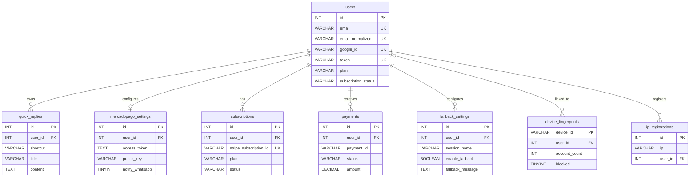
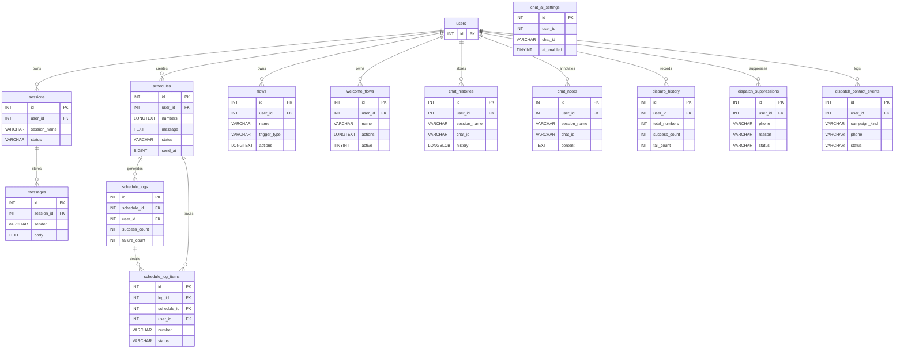
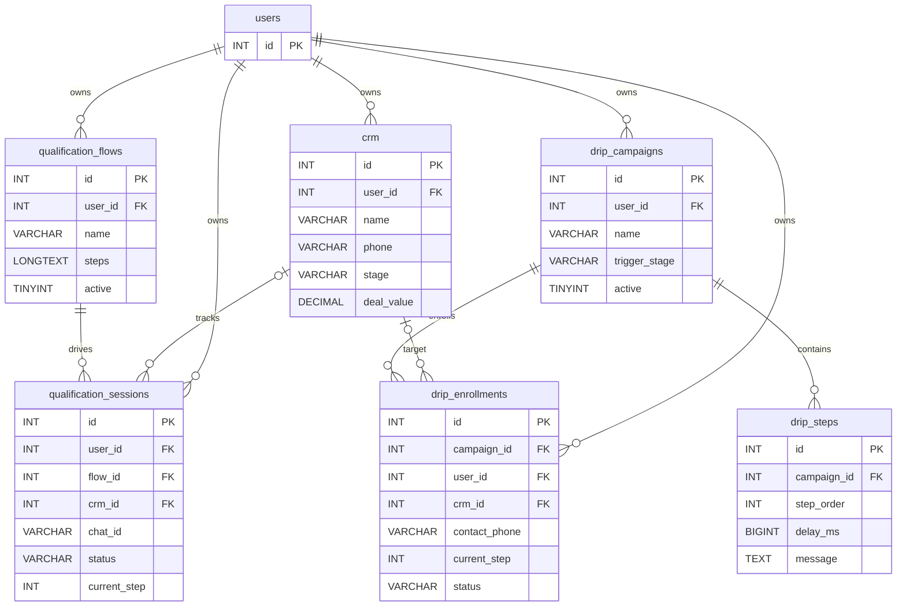
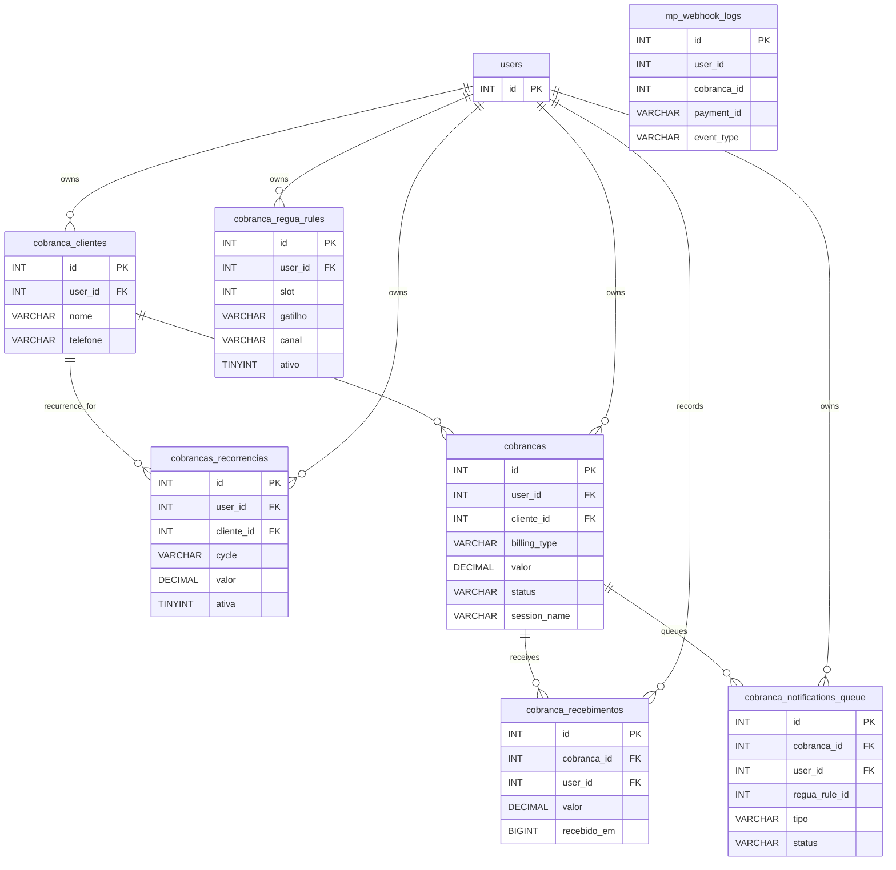
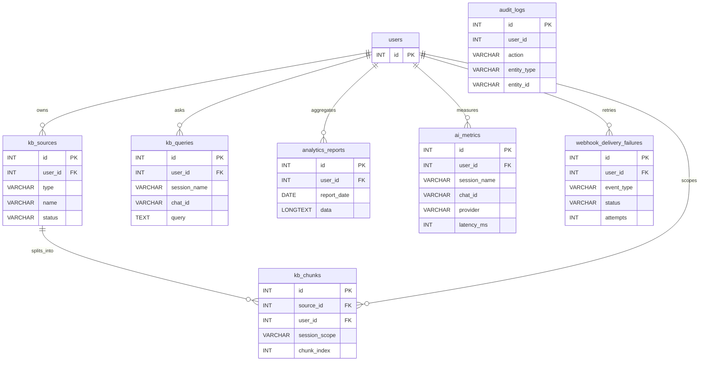

# Database Diagram

Fonte principal: [src/database.ts](C:\Users\Vinicius\Desktop\projetos\whatsapp-bot-ia - multisessoes - 3.0 - Stripe - mysql\src\database.ts)

Este diagrama foi derivado do bootstrap do schema em `initDB()`. Para evitar um unico canvas enorme, ele foi separado por dominio funcional.

## 1. Contas, autenticacao e configuracoes

## 2. WhatsApp, chats e automacoes de mensagem

## 3. CRM, qualificacao e campanhas drip

## 4. Cobrancas e recebimentos

## 5. Base de conhecimento, analytics e operacao

## 6. Tabelas auxiliares sem relacionamento forte no schema

- `checkout_leads`
- `stripe_events`
- `stripe_webhook_failures`
- `email_templates`
- `plan_configs`
- `rate_limits`

## Observacoes

- `mp_webhook_logs`, `chat_ai_settings` e `audit_logs` carregam chaves de negocio ligadas a usuario, mas sem `FOREIGN KEY` explicita no schema atual.
- O bootstrap em [src/database.ts](C:\Users\Vinicius\Desktop\projetos\whatsapp-bot-ia - multisessoes - 3.0 - Stripe - mysql\src\database.ts) contem criacao duplicada e idempotente de `crm` e `quick_replies`; para o diagrama foi considerada apenas uma versao logica de cada tabela.
- O foco aqui foi o modelo relacional. Indices auxiliares, colunas de telemetry e campos de payload longo foram resumidos para manter o diagrama legivel.
